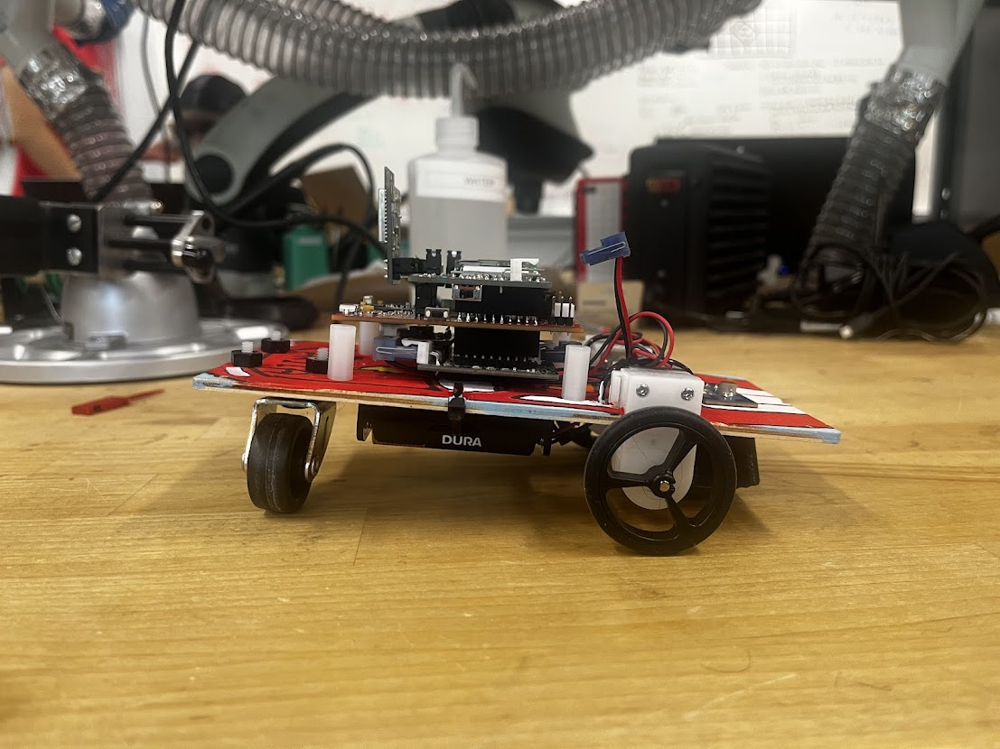
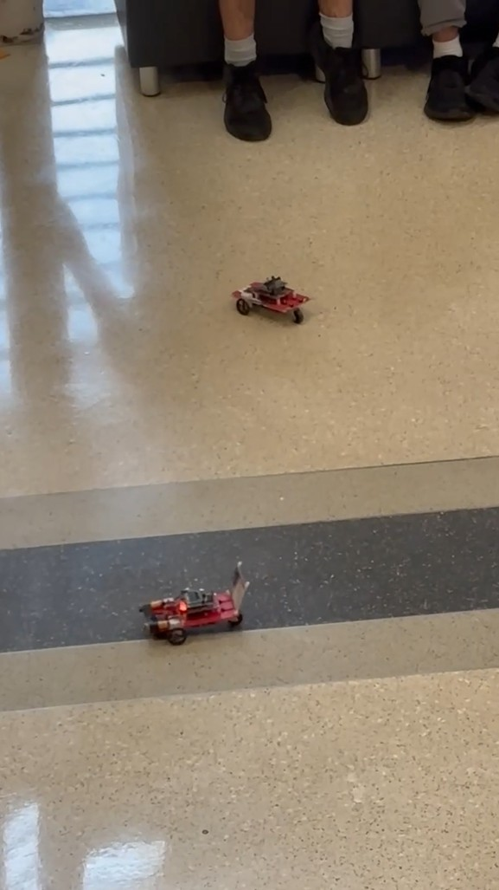

# AutoNav-IoT-LineFollower
IoT-enabled autonomous car developed for ECE 306 at NC State University. Navigates via Wi-Fi commands, autonomously detects and follows a black line, performs precise maneuvers, and displays real-time status on an LCD. Combines embedded firmware, sensor integration, and motor control.

# IoT Autonomous Car Project

## Summary

This project was a full-stack embedded system implementation involving power regulation, sensor integration, motor control, UART and Wi-Fi communication, and autonomous behavior. It pushed my skills in real-time programming, hardware debugging, and system integration. Each step brought the project closer to a functioning IoT-enabled robotic system, culminating in a successful hands-free demonstration of remote and autonomous navigation.

All source code, documentation, and per-project logs can be found in the individual project directories.

## Final Accomplishment

The final product is a fully autonomous, Wi-Fi-enabled car controlled by an MSP430FR2355 microcontroller. The car is capable of connecting to a wireless network, navigating a multi-checkpoint obstacle course via remote Wi-Fi commands, and then transitioning into autonomous mode to detect, follow, and circle around a black electrical tape loop before exiting independently.

Over the course of 10 projects, I designed, soldered, programmed, debugged, and tested both the hardware and firmware. This included building the power and control systems, integrating motor control through an H-Bridge, implementing analog sensors, using serial and wireless communication protocols, and orchestrating it all into a real-time embedded system. The result was a successful end-to-end demo that showcased embedded control, autonomous logic, and network communication.

---

## Project Breakdown

### Project 01 – Battery Power System
I built and tested the power supply for the entire embedded system. Using a battery pack and voltage regulation circuitry, I ensured a stable 3.3V output. Proper operation was verified using a digital multimeter to confirm clean and consistent power delivery.

### Project 02 – LCD Integration
I mounted and soldered an LCD display to the Power/Display board and connected it to the FRAM microcontroller. Using provided demo code, I verified proper initialization, backlight control, and response to button inputs. This became my primary interface for debugging and system feedback.

### Project 03 – H-Bridge Forward Motion
For the first time, I added motor control through a partial H-Bridge circuit, enabling basic forward motion. I validated that the car could move forward after a delay and stop based on a simple state machine, confirming that the motors and logic were functioning correctly.

### Project 04 – Controlled Movement Patterns
Using only forward movement, I programmed the car to navigate in circular, figure-8, and triangular patterns. I used state machines and timing logic to control motor speeds and transitions, and displayed the active shape name on the LCD during execution.

### Project 05 – Full H-Bridge Control
I completed the motor control circuitry by installing the remaining N-FETs and P-FETs. This allowed the car to travel in reverse and spin in place. I implemented interrupt-driven timers to create sequences that included forward, reverse, and spinning movements.

### Project 06 – ADC Black Line Detection
In this project, I mounted and wired an emitter/detector circuit under the car. Using the onboard ADC, I programmed the system to detect transitions between white and black surfaces. The car used this sensor input to stop on a black line and rotate into alignment.

### Project 07 – Circle Navigation
I extended the line detection logic from Project 6 to navigate around a circular path marked with black tape. The car followed the line for two full loops and then exited into the center, with LCD messages indicating the current stage such as "Circling" and "Exiting."

### Project 08 – Serial Communication
I configured UART communication on the MSP430 to communicate with a host PC via the onboard USB interface. This allowed me to send and receive debug messages through Tera Term or Analog Discovery, which was critical for testing sensors and movement logic.

### Project 09 – Wi-Fi Communication
I integrated and programmed the ESP32-WROOM module to allow Wi-Fi connectivity. Once connected, the car could display its IP address and receive remote movement commands. I used this to control the car's motion in preparation for the final multi-pad navigation.

### Project 10 – Final IoT Autonomous Car
I brought everything together in the final demonstration. The car connected to Wi-Fi, displayed its IP, and responded to commands to navigate to eight sequential pads, displaying “Arrived 0X” at each. After reaching pad 8, I issued a single command to begin autonomous operation. The car located the black line, turned onto it, followed it to the circle, rotated around twice, and then exited—completing the entire course with no additional input. Status messages like “BL Start,” “BL Turn,” and “BL Stop” were displayed throughout.

---

## Key Features

- **Autonomous Navigation**: Line-following behavior using analog sensors and calibrated ADC thresholds.
- **PWM-Based Motor Control**: Independent control of two DC motors with adjustable speed and direction using software PWM.
- **LCD Output**: Live debugging and data output via a parallel-interface LCD.
- **Real-Time Interrupts**: Debounced user input via interrupt-driven button control.
- **Battery System**: Power management and physical design for mobile operation.
- **Reflectance Sensor Calibration**: Real-time ADC thresholding and tuning for accurate sensor response.
- **Modular Design**: Software written in stages, with reusable C modules and interrupt service routines.

## Hardware Components

- MSP430G2553 Microcontroller
- 4x DC Motors + H-Bridge Motor Driver
- 2x Reflectance Sensor
- LCD Module
- Push Button Interface
- Breadboard for signal routing
- Chassis and wheel platform

## Skills Gained

- Embedded C programming
- Register-level microcontroller configuration
- Real-time systems and interrupt handling
- ADC and PWM configuration
- Peripheral integration (LCD, sensors, motors)
- Breadboarding and embedded hardware design
- Debugging using LEDs, LCD, and serial I/O
- Modular software development in constrained environments

## Educational Value

This project simulated real-world embedded development: tight memory constraints, low-level control, real-time deadlines, and debugging without traditional OS support. It prepared me for systems-level firmware development and gave me an appreciation for the complexity of embedded design workflows used in automotive systems, robotics, consumer electronics, and IoT devices.

## Demo

